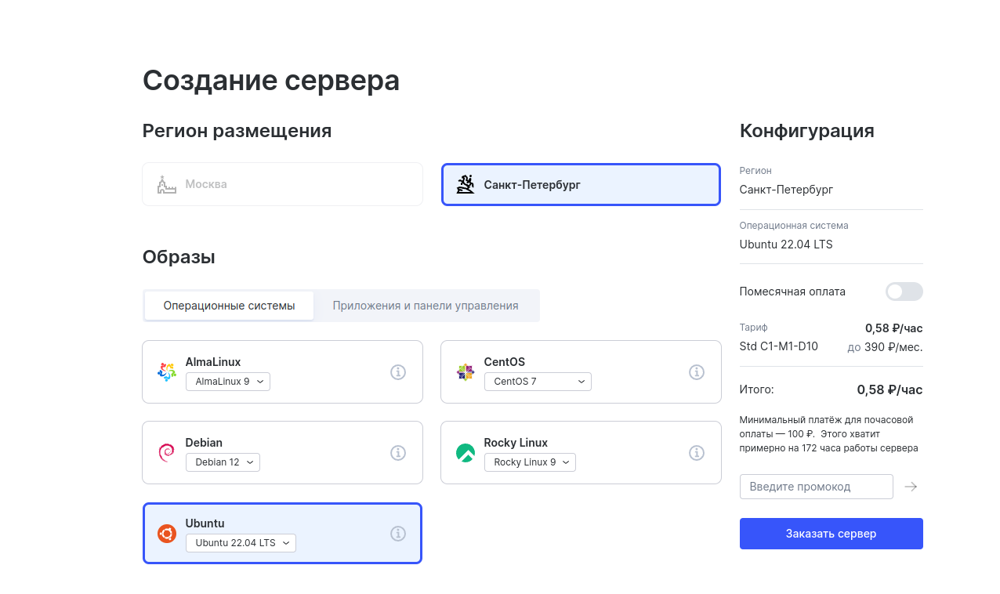
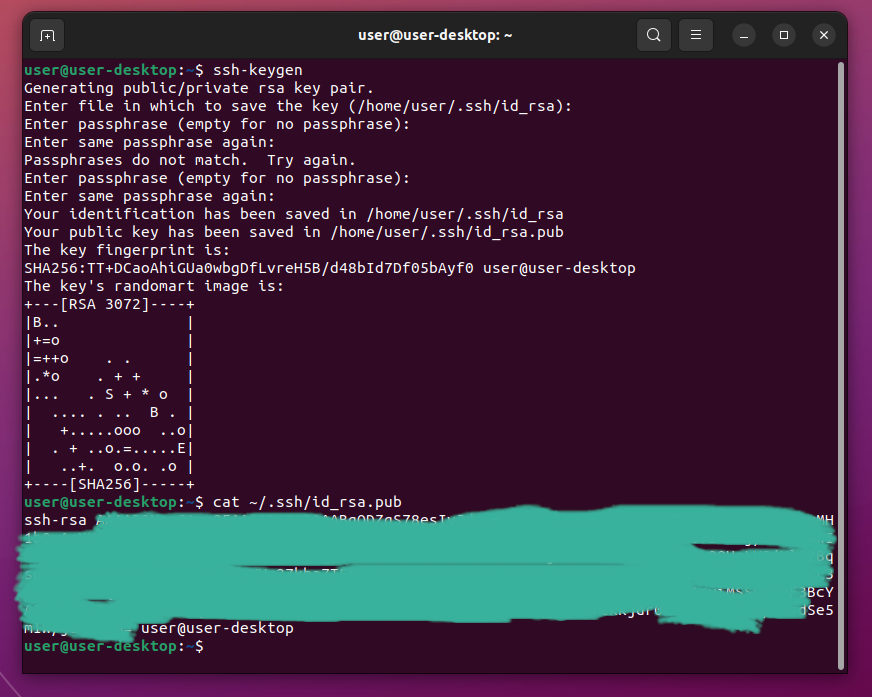
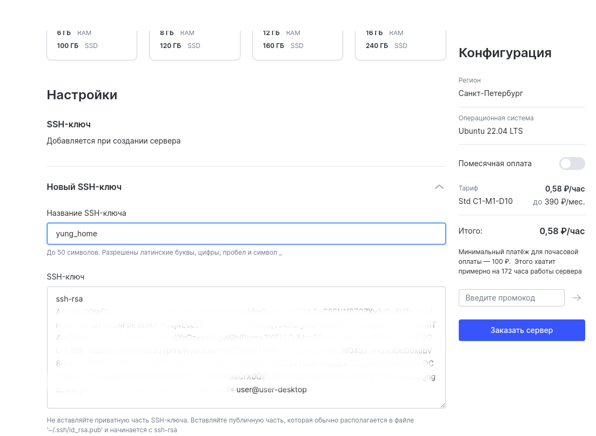
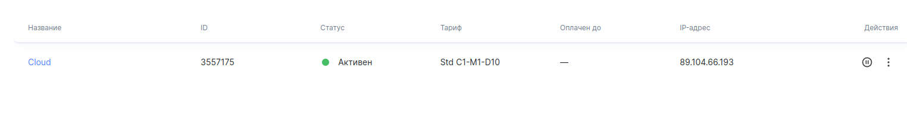
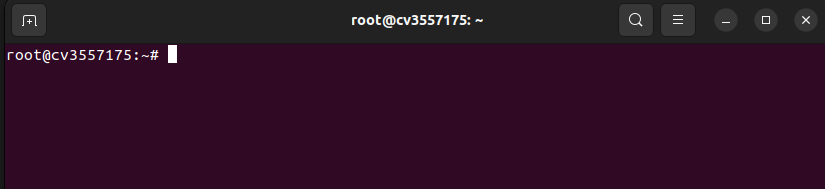

# Описание backend:

- [Общая информация](#общая-информация)  

- [Развертывание сервера](#развёртывание-сервера-на-платформе-regru)


 ## Общая информация

При разработке серверной части приложения принял решениене не переиспользовать готовые решения Django, а составить схему БД, проверку аутентификации и авторизации самостоятельно.

Схема хранения информации в базе данных проекта:  
  


Хранение файлов и аватаров организовано в соответствующих директориях с распределением по папкам с id пользователя.
Удаление файлов с физического диска производит библиотека django-cleanup.

При прохождении аутентификации(при входе) генерируется токен сессии который сохраняется в бд и передается в теле ответа клиенту. На клиенте браузер получив токен, сохраняет его в localForage, после чего токен передается в заголовках каждого  запроса. Получив запрос сервер перед каждым действием проверяет существование данного токена в БД, чтобы убедиться в прохождении аутентификации клиентом.  
Дополнительно периодически производится проверка аккаунта на "флаг" наличия прав администратора.

При обратной аутентификации(при выходе) токен удаляется из БД и из браузера на клиенте.  

При необходимости можно реализовать функцию проверки даты/времени создания токена и удалять его из бд после прохождения какого-то срока.

 ## Развёртывание сервера на платформе reg.ru

Для доступа к управлению сервером генерируем SSH в своей системе:  
```bash
ssh-keygen
```  

Переходим на сайт [reg.ru](https://www.reg.ru), проходим аутентификацию/регистрацию. Заходим в облачные сервисы и приступаем к созданию нового сервера:  
  

Копируем сгенерированный ssh:  
```bash
cat ~/.ssh/id_rsa.pub
```
  

вставляем ssh в соответствующее поле при создании сервера:  
  

Через несколько минут после отправки запроса на создание сервера, индикация статуса подвердждает создание и работу сервера:  
  
а на на почту, к которой привязан аккаунт reg.ru приходят ip и пароль для управления сервером. Через консоль заходим на сервер :
``` bash
ssh root@0.0.0.0
```
где вместо 0.0.0.0 вводим ip созданного сервера.  
Далее по запросу вводим пароль и получаем root доступ к системе сервера:  
  

Создаем нового пользователя, чтоб с root правами ничего не "сломать":
```bash
adduser user
```
где вместо user вводим имя нового пользователя. Задаем пароль, задаем данные о пользователе(можно оставить пустыми), подтверждаем правильность введенных данных - пользователь создан. 

Наделяем вновь созданного пользователя правами superuser(su):
```bash
usermod user -aG sudo
```
где вместо user вводим имя нового пользователя.  

Переподключаемся на вновь созданного пользователя:
```bash
logout
ssh user@0.0.0.0
```
где вместо user вводим имя нового пользователя, вместо 0.0.0.0 вводим ip созданного сервера.  

Приступаем к установке необходимых пакетов.  
Перед установкой обновляем список репозиториев:
```bash
sudo apt update
```
Рекомендуется так же установить последние стабильные версии установленных пакетов:
```bash
sudo apt upgrade
```
Пакеты с обновлениями системы облака(ssh, cloud...), на которые приходили отдельные подтверждения, не обновлял(keep stable version). 

Устанавливаем необходимые пакеты:
```bash
sudo apt-get install python3 python3-venv python3-pip postgresql nginx
```
Проверить установленный пает можно командой:
```bash
packadge_name --version 
```
где вместо packadge_name вводим имя пакета. Например проверяем установку python:
```bash
python3 --version 
```
активацию postgres:
```bash
sudo systemctl status postgresql
```

По примеру видеолекции "Практика с сервером" для удобства создаем пользователя в psql имя которого соответствует имени пользователя в системе:
```bash
sudo su postgres
psql
CREATE USER user WITH SUPERUSER;
ALTER USER user WITH PASSWORD '...';
CREATE DATABASE user;
```
где вместо user вводим имя пользователя, вместо ... - пароль.  
**Имя пользователя и название системной БД должны совпадать!**  

Выходим из psql и подключаемся обратно через пользователя user и создаем базу данных для проекта:
```bash
\q
exit
psql
CREATE DATABASE name
\q
```
где вместо name вводим имя БД проекта.

В домашней директории пользователя клонируем репозиторий нашего проекта и опускаемся по папкам проекта до директории с файлом manage.py.

