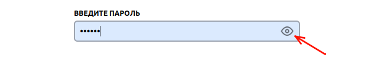
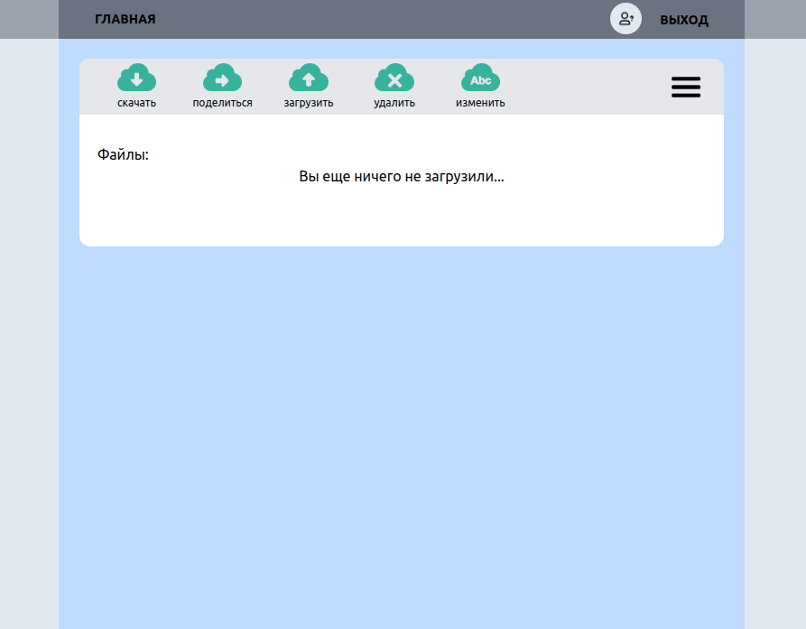
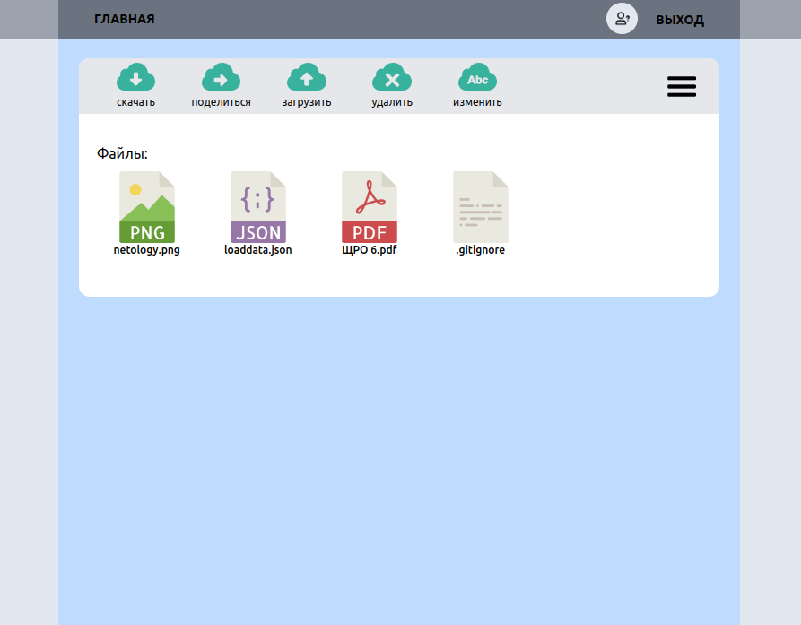
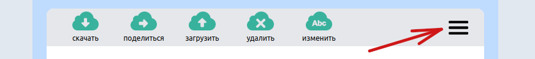
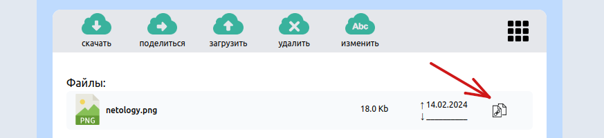
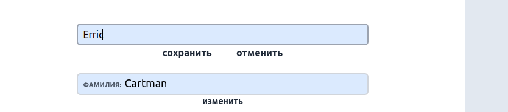
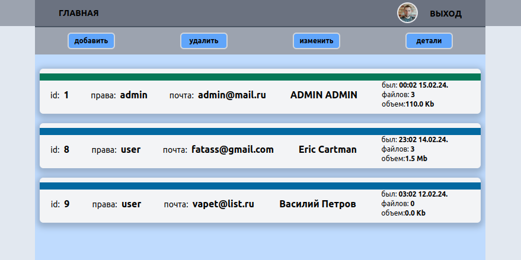
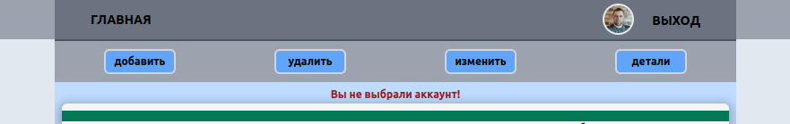

 # Описание интерфейса:  

 - [Общая информация](#общая-информация)  

 - [Интерфейс пользователя](#интерфейс-пользователя)  

 - [Интерфейс администратора](#интерфейс-администратора)  

 - [Итог](#итог)

 ## Общая информация

### Страница входа в сервис
При первой загрузке, а так же при не пройденной аутентификации(или выходе из сервиса), корневой роут отображает индексную страницу входа:
  

Для входа в сервис, в соответствующих полях предлагается ввести почту и пароль.  
"Шапка" сервиса имеет несколько активных элементов:

1) текстовая ссылка для перехода на главную страницу, 
2) ссылка с аватаром для перехода на [страницу личных данных](#страница-личных-данных)  
3) текстовая ссылка для выхода(обратной аутентификации)

Кнопка "выход", а так же аватар появляются после успешного прохождения аутентификации. Если аватар не установлен, отображается дефолтная картинка, как при входе.

Внизу страницы находится "нижний колонтитул" с текстовой ссылкой на страницу с информацией по проекту:  

Перед отправкой запроса значения полей логина и пароля проходят простую валидацию:
- пароль - не пустое значение с проверкой пробелов в начале и в конце строки, количество символов пароля > 5
- почта - не пустое значение с проверкой пробелов в начале и в конце строки, а также значение содержит символ "@"  

**Данные условия валидации распространяются на все дальнейшие действия, связанные с изменениями почты и пароля.**

Если поля не прошли валидацию отображаются соответствующие ошибки:  
  

Если поля проходят валидацию, логин и пароль проверяются на сервере.
При вводе неверных/несуществующих логина или пароля выводится сообщение об ошибке:  
  

Если вы зарегистрированы в сервисе и ввели корректные почту и пароль вас перенаправит на главную страницу с интерфейсом [пользователя](#интерфейс-пользователя) или [администратора](#интерфейс-администратора), в зависимости от ваших прав. 

В хвосте поля "пароль" находится переключатель отображения пароля, который открывает или прячет вводимое значение:
  

Ниже, под кнопкой "вход", расположена строковая ссылка на страницу регистрации:   

### Страница регистрации
Страница регистрации представляет общий набор, полей необходимых для регистрации пользователей:  

**Важно:** процесс регистрации позволяет создать аккаунт только обычного пользователя.
Создать аккаунт с правами администратора или наделить ими любого другого пользователя, можно только из-под учетной записи администратора через админ.интерфейс.

Для регистрации достаточно заполнить обязательные поля: "пароль" и "электронная почта"; остальные носят информативный характер. Строковые зачения почты и пароля проходят общую простую валидацию.

Для удобства ввода пароля и повторного ввода пароля в конце полей расположеныа переключатели отображения пароля:
  

 а так же при фокусировке на поле, появляется подсветка, которая явно дает понять: 
- удовлетворяет ли вводимое значение пароля условиям валидации
- совпадает ли значение повторного ввода с первичным

  
  

Если значение почты/пароя не проходят валидацию выводится сообщение об ошибке:

Если электронная почта уже привязана к какому-либо аккаунту, так же отобразится ошибка.  

В случае корректной регистрации появляется информационное сообщение, сообщающее об успехе:  

После нажатия кнопки "ок" система перенаправляет пользователя на индексную страницу входа в сервис. Это же происходит при нажатии кнопки "отмена" на странице регистрации.

## Интерфейс пользователя

### Главная страница пользователя
При успешной аутентификации пользователя перенаправляет на главную страницу пользователя:
  

Под основной "шапкой" расположены кнопки управления файловым хранилищем, с функционалом соответствующим названию. Если загруженных файлов нет - в окне файлов, под кнопками управлени выводится информационное сообщение об их отсутствии. После загрузки файла сообщение пропадает, а в окне появляется иконка с названием файла:  
  

Иконка подбирается в зависимости от расширения файла. Для файлов с неизвестным расширением устанавливается дефолтная иконка (пример .gitignore): 
  
Полный список поддерживаемых расширений можно посмотреть [здесь](https://github.com/yung78/graduate_work/blob/main/frontend/src/app/appData.js)  

При нажатии кнопки "загрузить" браузер откроет окно выбора файлов для отправки на сервер.

Все остальные действия(реакции кнопок) можно производить только после фокусировки на каком-либо файле. В противном случае будет выводиться сообщение об ошибке (отображение 3 секунды):  
  

Фокусировка производится однарным кликом ЛКМ по файлу. Снятие фокусировки происходит при клике в любое место окна браузера, кроме функциональных кнопок. Файл в фокусе подсвечивается изменением цвета заднего фона:  

При нажатии кнопки "скачать" браузер откроет окно выбора места сохранения файла.

При нажатии кнопки "удалить" отобразится окно подтверждения удаления файла:  

Нажимая кнопку:
- "удалить" мы подтверждаем данное действие
- "отмена" отменяем удаление

оба варианта по окончанию действия закрывают окно и снимают фокус с файла. Однарный клик ЛКМ вне модального окна равносилен нажатию кнопки "отмена" - закрывает окно, снимает фокус.

При нажатии кнопки "поделиться" отобразится окно со ссылкой для сохранения(скачивания) файла сторонним пользователем:  
  

Нажатие кнопки закрыть или клик вне модального приводят к закрытию окна и снятию фокуса с файла.

Ссылку можно либо скопировать в ручную, выделив текст, либо нажатием иконки копирования в правом верхнем углу:  
  

### Страница сохранения файла
При переходе любым пользователем по ссылке откроется страница сохранения файла. Если ссылка корректна - в центре окна появится иконка с названием файла и кнопка "скачать":
  

Если ссылка с опечаткой, или пользователь удалил файл - в центре окна появится сообщение об ошибке:
  

Копировать ссылку на файл можно другим способом. По умолчанию отображение файлов установлено в виде "плитки". Нажав на кнопку в меню управления файлов можно изменить вид на "список":  
  

При отображении файлов списком, помимо дополнительной информации о файле(размер и когда создан), можно увидеть иконку копирования ссылки:  
  

Нажатие на иконку ЛКМ приводит к получению и копированию ссылки на файл без открытия модального окна.

### Страница личных данных
После прохождения аутентификации становится активной кнопка с аватаркой:  
  
которая перенаправляет нас на страницу своих личных данных:  
  

Каждая кнопка "изменить" открывает свое поле для изменения личных данных:  
  

Кнопка "сохранить" сохраняет сизменения и закрывает поле при успешном внесении изменений. "отмена" закрывает поле.

При нажатии кнопки под аватаром, браузер открывает окно выбора файла аватара. Для успешного изменения загружаемый файл должен быть изображением - содеражть "image" в значении свойства "type", при формировании Formdata. Если файл не проходит валидацию, отобразится сообщение об ошибке(отображение 3 секунды):  
  

При успешном изменении аватара, или любого из полей отобразится сообщение об успехе:  
  

При изменении почты или пароля значение проходит простую валидацию, как при регистрации. При изменении пароля дополнительно необходимо ввести старый пароль:  
  

В случае ошибки отобразится сообщение с кратким описанием:  
  

Нажатие кнопки "вернуться" равносильно нажатию кнопки "назад" в браузере. 

## Интерфейс администратора

### Главная страница администратора
При успешной аутентификации администратора перенаправляет на главную страницу администратора:  
  

Под основной "шапкой" расположены кнопки управления аккаунтами с функционалом, соответствующим названию.  
Далее, под меню управления отображается список зарегистрированных в сервисе аккаунтов. Каждый элемент содержит набор информации об аккаунте: id, права, e-mail, имя и фамилия(если есть), последнее посещение сервиса, количество загруженных файлов, и общий объем загруженных файлов:  
   

При нажатии кнопки "добавить" отображается окно создания нового аккаунта:  
  

Обязательные для заполнения поля - почта и пароль.  
Отмеченный чекбокс - наделяет аккаунт правами администратора. По дефолту создаётся обычный аккаут(пользователь).  
Кнопка "добавить" сохраняет введенные данные и создает новый аккаунт, "отмена" - отменяет действие.

Поля почты и пароля проходят стандартную простую валидацию. Если поля не проходят валидацию, отобразится сообщение об ошибке(отображение 3 секунды):  
  

Если электронная почта уже привязана к какому-либо аккаунту, также отобразится соответствующая ошибка. 

Нажатие кнопок "изменить" или "удалить" можно производить только после фокусировки на каком-либо аккаунте. В противном случае будет выводиться сообщение об ошибке (отображение 3 секунды):  
  

Фокусировка производится **однарным** кликом ЛКМ по аккаунту. Снятие фокусировки происходит при клике в любое место окна браузера, кроме функциональных кнопок. Аккаунт в фокусе подсвечивается изменением цвета заднего фона:  
  

При **двойном** клике по аккаунту происходит переход на [страницу карточки](#страница-карточки-аккаунта) данного аккаунта.  

При нажатии кнопки "удалить" отобразится окно подтверждения удаления файла:  

Нажимая кнопку:
- "удалить" мы подтверждаем данное действие
- "отмена" отменяем удаление

оба варианта по окончанию действия закрывают окно и снимают фокус с аккаунта. Однарный клик ЛКМ вне модального окна равносилен нажатию кнопки "отмена" - закрывает окно, снимает фокус.  

При нажатии кнопки "изменить" отображается окно изменения аккаунта:  
  

Поле пароля обязательно для заполнения и проходит стандартную валидацию. Если поле не проходит валидацию, отобразится сообщение об ошибке.
Отмеченный чекбокс - наделяет аккаунт правами администратора.  

Кнопка "изменить" сохраняет измененные данные, "отмена" - отменяет действие.
Оба варианта по окончанию действия закрывают окно и снимают фокус с аккаунта.

### Страница карточки аккаунта
Страница открывается при двойном клике по аккаунту:  
  

При двойном клике по своему аккаунту вас перенаправит на [страницу личных данных](#страница-личных-данных).  

Здесь, помимо информации отдельно взятого аккаунта из списка, отображается аватар и список загруженных файлов.

Нажатие кнопки "изменить" под аватаром открывает окно для выбора файла.
Изменение аватара происходит по тому же принципу, как и на странице личных данных.  

Нажатие кнопки "изменить" под данными открывает окно с теми же установками и функционалом, как и на главной странице:

## Итог

Не стал добавлять в админку управление файлами пользователей и изменение пароля(при необходимости добавлю на доработке). Так же была идея реализации поиска и фильтрации аккаунтов по различным параметрам(id, email, fullSize), но по времени уже затянул с выполнением и решил оставить по дефолту(id по возрастанию).
